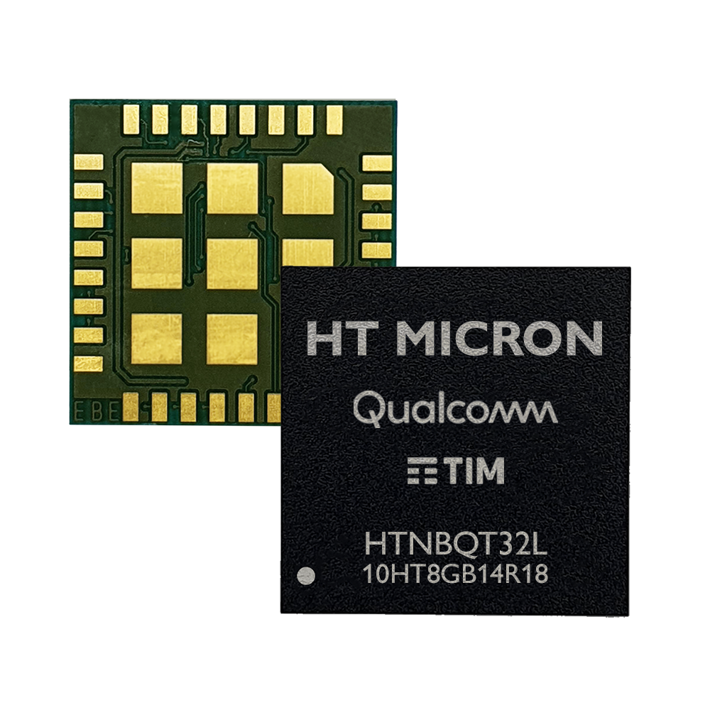

# iMCP HTNB32L-XXX - HT Micron's NB-IoT SiP

  

 

iMCP HTNBAT32L-XXX is a highly compact and low-power wireless communication MCO/SiP featuring Qualcomm QCX-212 LTE IoT Modem supporting single-mode 3GPP Release 14 Cat. NB2 IoT connectivity.

 

## Main Topics

 

* Start your development by going through our [Software Development Kit (SDK)](https://github.com/htmicron/HTNB32L-XXX-SDK).
* Just got a HTNB32L Evaluation Board? Read the [Getting Started](https://github.com/htmicron/HTNB32L-XXX-SDK/blob/main/Docs/1-User_Manual/HTNB32L-XXX-UM0001-Getting_Started.pdf) document.
* Get the latest version of our [Datasheet](https://github.com/htmicron/HTNB32L-XXX-SDK/blob/main/Docs/3-Datasheet/DS031-HTNB32L.pdf) and other [Documentation](https://github.com/htmicron/HTNB32L-XXX-SDK/tree/main/Docs).
* Find compiled binaries and firmware projects [here](https://github.com/htmicron/HTNB32L-XXX-SDK/tree/main/Firmware).
* Simplify your hardware design with our [PCB Design Examples](https://github.com/htmicron/htnb32l-xxx/tree/pcb_examples).

 

## Commercial Contact

For commercial matters, please contact imcp@htmicron.com.br.

## Support

If you require technical support, please submit a ticket [here](https://forms.clickup.com/30922216/f/xfnf8-16347/KBY0CL3SXRGB73D0GR).

